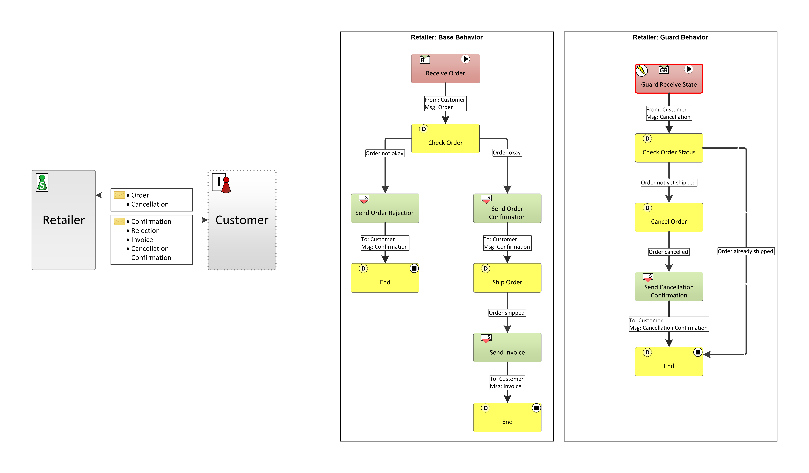
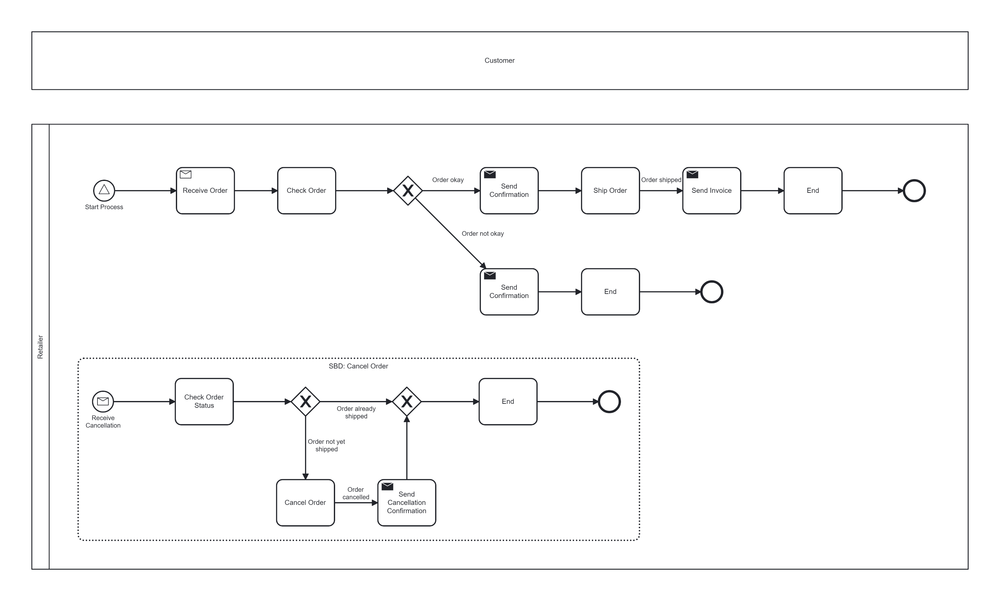

# PASS to BPMN Converter

This C# project enables the conversion of PASS models to BPMN, preserving as much of the executional semantics as possible. The converter supports most of the PASS standard including the conversion of *Subject Interaction Diagrams* and *Subject Behavior Diagrams* (*Base*, *Macro*, and *Guard Behaviors*).

The project utilizes the [alps.net.api](https://github.com/I2PM/alps.net.api) to parse a PASS model from an OWL input file and transforms it to a BPMN model compliant with the BPMN 2.0 specification. Diagram elements are automatically generated and arranged using a basic layout algorithm.

## Usage

To convert a PASS model to BPMN, build the project and run:
```
pass-bpmn-converter.exe <owl_input_file_path> <bpmn_output_file_path>
```

## Example

The [sample](pass-bpmn-converter/sample) folder contains a conversion example. The ```.bpmn``` file was automatically generated from the ```.owl``` file using the converter with minor layout adjustments made to improve readability. The resulting BPMN model can be viewed, for example, using [bpmn.io](https://bpmn.io/). The folder also contains the original MS Visio file of the PASS model which can be viewed and edited using the [PASS Visio Shapes](https://subjective-me.jimdofree.com/visio-modelling/).

### Input PASS Model

### Output BPMN Model


## Limitations

- The conversion of *Choice Segments*, non-standard *Send* and *Receive Types*, and *Data Object* is not yet supported
- Not all PASS elements and concepts can be converted to BPMN completely accurately. This includes:
    - *End States* with outgoing *Transitions* as well as the joint termination of *Subjects*
    - *State References* and *Return to Origin* states inside of *Guard Behaviors*
    - *Input Pools*